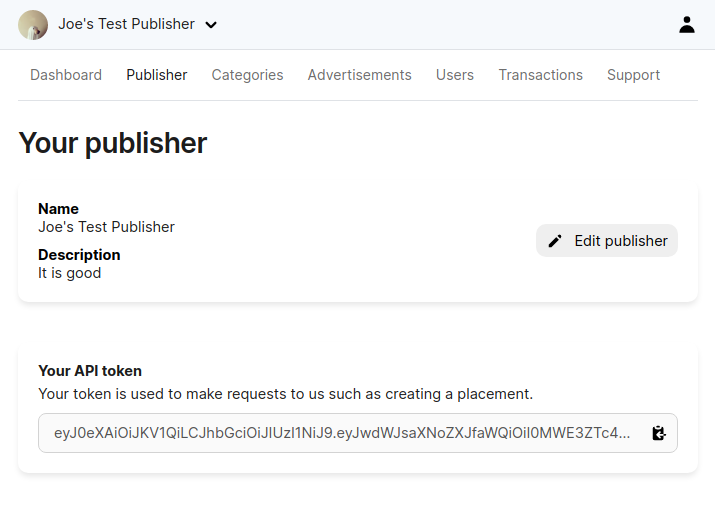

# Authentication

Some of our API endpoints require an API token. This token **must be kept secret** and never exposed to users, or they could perform administrative actions on your behalf.

## Finding your API token

You can find your API token by going to the [Publisher Dashboard](https://publisher.enlay.io) > `Publisher` > `Your API token`.



## Authenticating with the API

Set the HTTP `Authorization` header to the API token.
```
Authorization: eyJ0eXj2dWdawd....
```

### Authenticating with an SDK

If you're using one of our [SDKs](./sdks.md), please refer to the docs.

